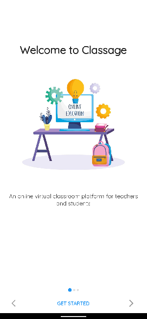
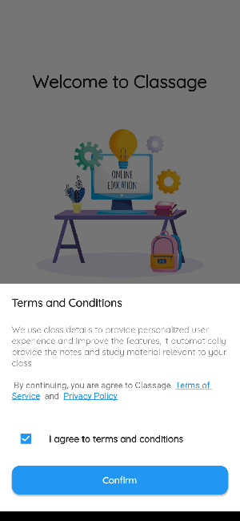
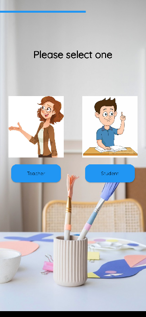
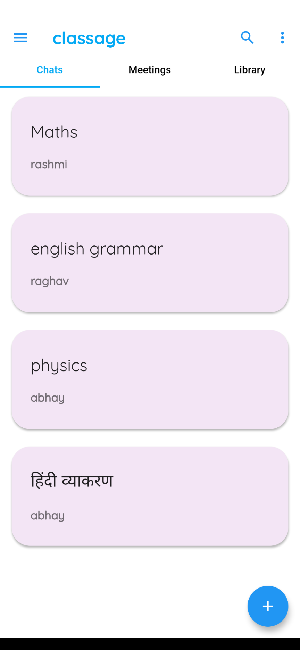
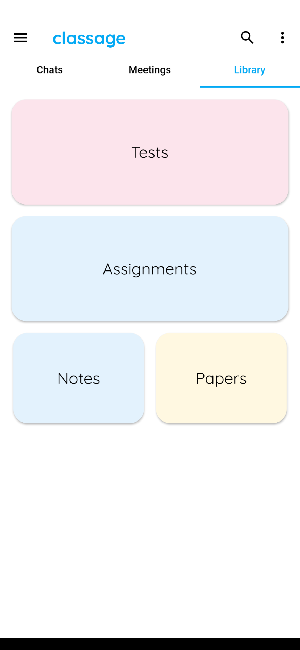

<h1>Classage: A classroom App for teachers and students</h1>
<h2>Features are:</h2>
<li>Video Conferencing</li>
<li>Create Pdf</li>
<li>Share Assignments</li>
<li>Take Quizes</li>
<li>Group Messaging</li>

## Getting Started

This project is made by flutter, firebase, jitsi meet.
## Flutter Installation
Download flutter sdk (https://flutter.dev/docs/get-started/install)
Set flutter sdk path ('path = C:\src\flutter')
set dart sdk path (C:\src\flutter\bin\cache\dart-sdk\bin)
Open command prompt and run 'flutter doctor'
Accept android toolchain and other licence.
Open your favourite editor Android studio and VS Code are mostly preferred
install flutter and dart plugin.

## Firebase Setup
For firebase you must have a google account
Go to firebase console and create new project by following the given instructions.
add the depencency to app/build.gradle and project level build.gradel file.
Download google services.json file and paste it to android/app folder.

## Run
Open Pubspec.yaml file and do pub get or run command 'flutter pub get'
after successfully getting all dependencies run your project. 

A few resources to get you started if this is your first Flutter project:

- [Lab: Write your first Flutter app](https://flutter.dev/docs/get-started/codelab)
- [Cookbook: Useful Flutter samples](https://flutter.dev/docs/cookbook)

For help getting started with Flutter, view our
[online documentation](https://flutter.dev/docs), which offers tutorials,
samples, guidance on mobile development, and a full API reference.

